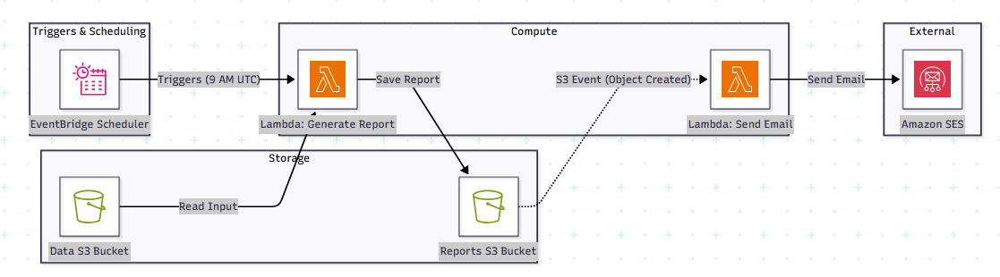

## Project Motivation

I decided to build this project to get real, hands-on experience with AWS cloud services working together. In this project, I created a serverless workflow where a Lambda function automatically generates reports and stores them in S3, triggered by EventBridge.

This helped me learn how different AWS services can communicate and work together automatically, while also practicing Terraform for setting up and managing the cloud infrastructure. The goal was to better understand cloud automation, serverless applications, and how to make services talk to each other in a practical, real-world project.

# AWS Lambda Report Generator Project

This project demonstrates how to **automate daily report generation on AWS** using **Lambda, S3, IAM, and EventBridge Scheduler** with **Terraform for infrastructure as code**.

---

## Architecture Overview



The diagram illustrates the workflow:

* **S3 Buckets:** `data_bucket` for input data, `reports_bucket` for generated reports.
* **Lambda Function:** Python code to generate reports.
* **IAM Roles:** Lambda and Scheduler roles with least privilege permissions.
* **EventBridge Scheduler:** Triggers Lambda daily at 9 AM UTC.
* **SES permissions:** The Lambda function’s IAM policy already allows sending emails via SES, but this functionality is not yet implemented in the Lambda code.


---

## Table of Contents

1. [Prerequisites](#prerequisites)
2. [Installing Terraform](#installing-terraform)
3. [Setting up Git and GitHub](#setting-up-git-and-github)
4. [Project Setup](#project-setup)
5. [Terraform Configuration](#terraform-configuration)
6. [Lambda Function](#lambda-function)
7. [Testing the Lambda Function](#testing-the-lambda-function)
8. [Terraform Workflow](#terraform-workflow)
9. [Cleanup](#cleanup)
10. [References](#references)

---

## Prerequisites

* AWS account with permissions for Lambda, S3, IAM, and EventBridge Scheduler.
* Terraform installed.
* Python 3.12 and `boto3` installed for Lambda deployment.
* Git and GitHub account for version control.
* `boto3` Python package for Lambda deployment. Instead of manually installing, you can use the included `requirements.txt` file:

```bash
pip install -r lambda/requirements.txt


---

## Installing Terraform

* Download Terraform from [Terraform Downloads](https://www.terraform.io/downloads) and add it to PATH.
* Verify installation:

```bash
terraform -v
```

---

## Setting up Git and GitHub

1. Verify Git installation:

```bash
git --version
```

2. Initialize Git repository:

```bash
git init
```

3. Link to GitHub repository:

```bash
git remote add origin https://github.com/<your-username>/<repo-name>.git
```

4. Commit and push changes:

```bash
git add .
git commit -m "Initial commit"
git push -u origin main
```

---

## Project Setup

1. Create project folder:

```bash
mkdir AWS_projects/LambdaReportGenerator
cd AWS_projects/LambdaReportGenerator
```

2. Place Lambda function in `lambda/report_generator.py` and create `lambda/function.zip`.
3. Create Terraform files: `main.tf`, `variables.tf`.

---

## Terraform Configuration

* **S3 Buckets:** `data_bucket` and `reports_bucket` (versioning enabled).
* **IAM Roles:** Lambda and EventBridge Scheduler roles.
* **Lambda Function:** Python report generator.
* **EventBridge Scheduler:** Daily trigger at 9 AM UTC.

Example `main.tf` snippet:

```hcl
resource "aws_lambda_function" "report_lambda" {
  function_name = "report_generator"
  role          = aws_iam_role.lambda_role.arn
  handler       = "report_generator.lambda_handler"
  runtime       = "python3.12"
  filename      = "lambda/function.zip"
  source_code_hash = filebase64sha256("lambda/function.zip")

  environment {
    variables = {
      REPORTS_BUCKET = aws_s3_bucket.reports_bucket.bucket
      EMAIL_ADDRESS  = var.email_address
    }
  }

  timeout     = 300
  memory_size = 512
}
```

---

## Lambda Function

* Located in `lambda/report_generator.py`.
* Generates a report and uploads it to `reports_bucket`.
* Example report output in S3:

```
Report generated at 2025-11-27 22:27:28.742976
```

* Example test response:

```json
{
  "statusCode": 200,
  "body": "{\"status\": \"success\", \"timestamp\": \"2025-11-27 22:11:54.358483\", \"message\": \"Hello from your Lambda!\"}"
}
```

---

## Testing the Lambda Function

1. Go to AWS Lambda console → `report_generator`.
2. Create a test event using `{}`.
3. Click **Test**.
4. Verify the report appears in `reports_bucket`.

---

## Terraform Workflow

1. Initialize Terraform:

```bash
terraform init
```

2. Plan resources:

```bash
terraform plan -var="email_address=your_verified_email@example.com"
```

3. Apply resources:

```bash
terraform apply -var="email_address=your_verified_email@example.com"
```

Confirm with `yes` when prompted.

4. Verify S3 buckets and Lambda function in AWS Console.

---

## Cleanup

To remove all resources:

```bash
terraform destroy -var="email_address=your_verified_email@example.com"
```

---

## References

- HashiCorp. Terraform Documentation. Retrieved from [https://developer.hashicorp.com/terraform/docs](https://developer.hashicorp.com/terraform/docs)  
- Amazon Web Services. AWS S3 Documentation. Retrieved from [https://docs.aws.amazon.com/s3/index.html](https://docs.aws.amazon.com/s3/index.html)  
- Amazon Web Services. AWS CLI Documentation. Retrieved from [https://docs.aws.amazon.com/cli/index.html](https://docs.aws.amazon.com/cli/index.html)  
- Amazon Web Services. AWS Lambda Documentation. Retrieved from [https://docs.aws.amazon.com/lambda/index.html](https://docs.aws.amazon.com/lambda/index.html)  
- Zazon, M. Automated Report Generation with AWS EventBridge. GitHub. Retrieved from [https://github.com/mzazon/awesome-cloud-projects/blob/main/aws/automated-report-generation-eventbridge/automated-report-generation-eventbridge.md](https://github.com/mzazon/awesome-cloud-projects/blob/main/aws/automated-report-generation-eventbridge/automated-report-generation-eventbridge.md)  
- OpenAI. ChatGPT (GPT-4/5 Model). Retrieved from [https://chat.openai.com](https://chat.openai.com)  

*— Xavier Dupuis*

